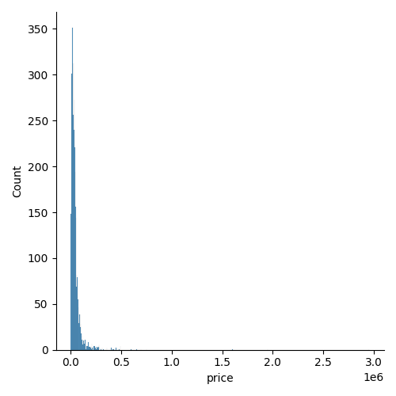
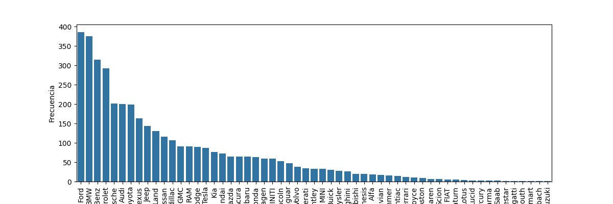
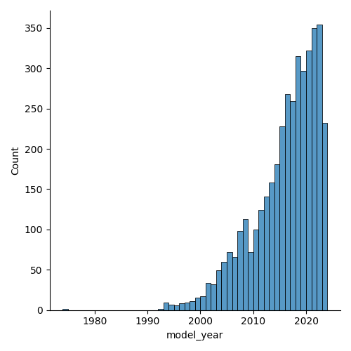

# Documentación del Análisis Exploratorio de Datos (EDA) de Autos Usados

## Título: Análisis de Mercado de Autos Usados

## Descripción General
Este proyecto de EDA tiene como objetivo explorar y analizar un conjunto de datos de autos usados.
El análisis se llevará a cabo utilizando herramientas de Python, como Pandas, Matplotlib y Seaborn. El objetivo principal
es comprender las tendencias del mercado de autos usados, identificar los factores que influyen en los precios 
de venta.

## Introducción
El conjunto de datos contiene información sobre autos usados, incluyendo detalles como marca, modelo, año del modelo,
millas recorridas, tipo de combustible, motor, transmisión, accidentes, precio. El próposito de 
este EDA es comprender cuáles son las variables que mayor correlación tienen en el precio de un auto.

## Metodología 
### Datos
* Conjunto de datos: "used_cars.csv"
* Fuente de datos: Kaggle
* Variables clave: Precio, Marca, Modelo, Año, Kilometraje, Tipo de transmisión, Motor.

### Proceso de Análisis
1. Carga y limpieza de datos.
2. Análisis exploratorio de datos.
3. Visualización de datos.
4. identificación de tendencias y relaciones.
5. Análisis de precios en función de características clave.

## Exploración de Datos
A continuación, se presentan algunos hallazgos claves del EDA:

### Distribución de Precios

Gráfico de Precios

* La discrepancia entre la media ($44,553.19) y la mediana se debe a la influencia de algunos precios extremadamente altos en el conjunto de datos.
  Mientras que la media se afectada por estos valores atípicos, la mediana representa mejor el "precio central" de la mayoría de los autos usados.
* El 25% de los autos se venden por $17,000 o menos, mientras que el 75% de los autos se venden por $49,000 o menos. Esto sugiere que la mayoría de
 los autos se encuentran en la gama de precios considerablemente altos.
* El precio máximo registrado es considerablemente superior al promedio, lo que podría indicar la presencia de autos de lujo
  o valores atípicos en el mercado de autos usados.

### Marca de Autos

Gráfico de Distribución de Marcas

* Nuestro conjunto de datos contiene 57 marcas de autos.
* Las marcas Ford, BMW y Mercedes-Benz son las más populares en este conjunto de datos, con una alta cantidad de autos registrados. Esto sugiere
  que estas marcas pueden ser muy comunes en el mercado de autos usados representado en los datos.
* El conjunto de datos incluye una amplia variedad de marcas, desde marcas de lujos como Porsche, McLaren y Lamborghini, entre otros hasta más
  convencionales como Toyota, Nissan, Kia, entre otros.
* La diversidad de marcas en el conjunto de datos sugiere que el mercado de autos usados es variado y ofrece opciones para una amplia gama de
  preferencias y presupuestos.

### Año del Modelo

Gráfico de Precios

* El año promedio de fabricación de los autos en nuestra muestra es aproximadamente 2015.5. Esto indica que,
  en promedio, los autos en nuestra muestra tienen unos 8 años de antiguedad en el momento de la observación.
* La baja desviación estándar de 6.1 sugiere que la mayoría de los autos tienen años de modelo cercanos
  a la media (2015.5). esto refelja una relativa consistencia en la antiguedad de los autos en nuestra muestra.
* El rango de años de modelo va desde 1974 hasta 2024. El año más antiguo registrado es 1974, mientras que el más
  reciente es 2024. Esto indica que nuestra muestra abarca un amplio período de tiempo en términos de años de modelo.
* El primer cuartil (25%) se encuentra en 2012, lo que significa que el 25% más antiguo de los autos en nuestra muestra
  tiene un año de modelo igual o anterior al 2012. El tercer cuartil (75%) está en 2020, lo que significa que el 75% más antiguo de los
  autos tiene un año igual o anterior al 2020.